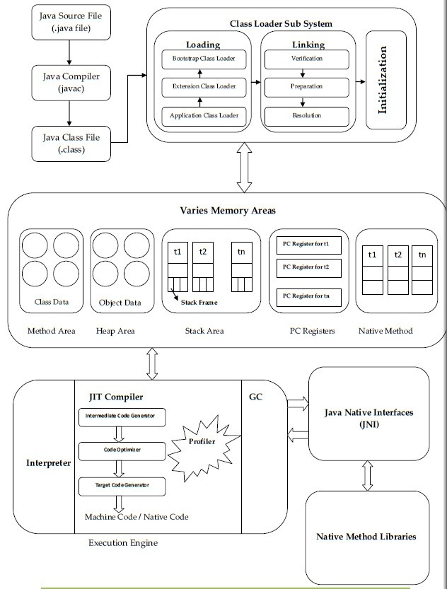
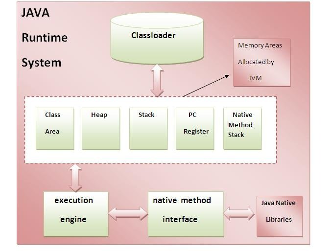
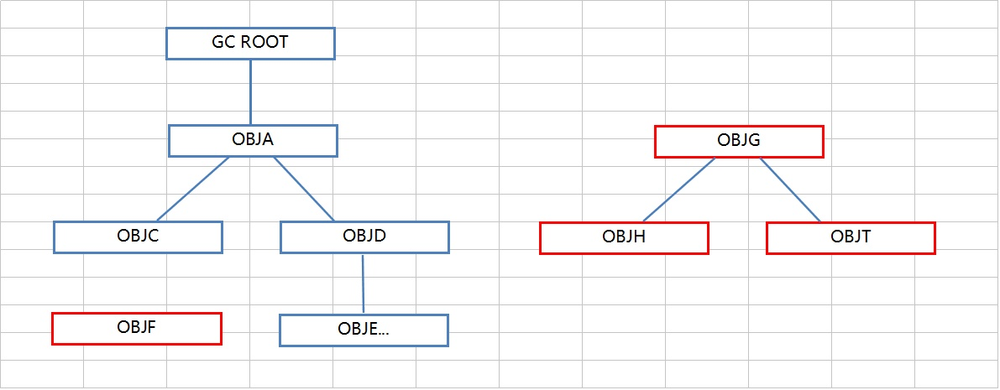
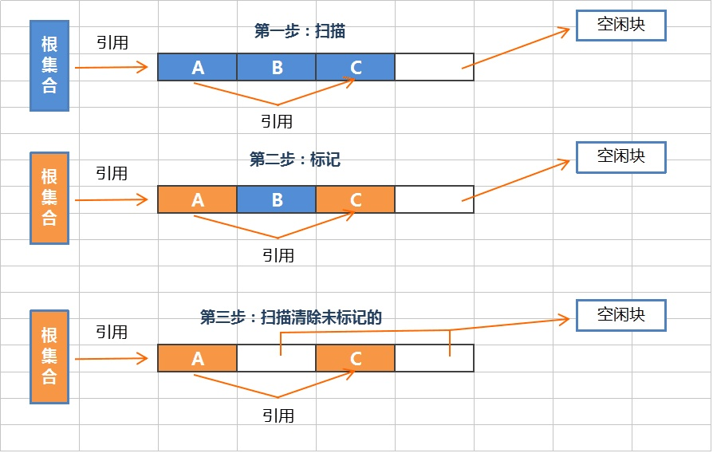
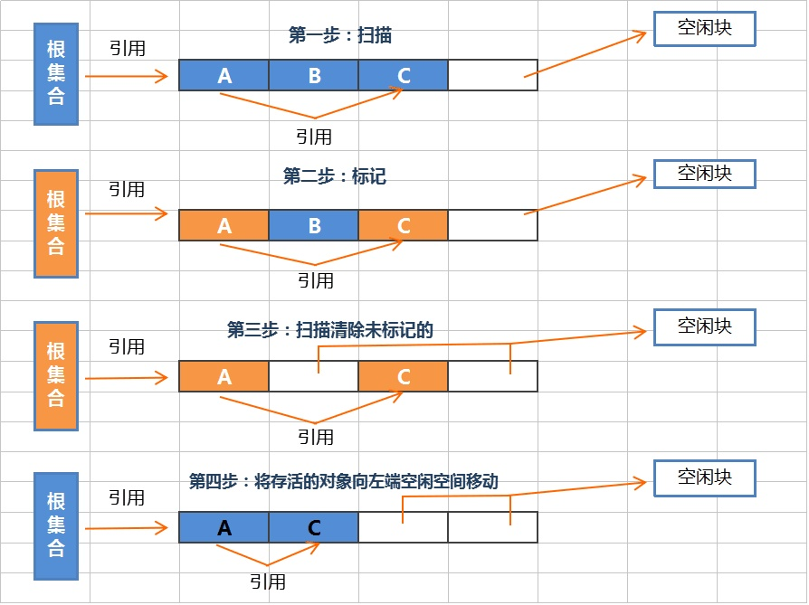

# JVM General

## 1. What is JVM

1.1 JVM stands for Java Virtual Machine, which is a virtual machine and implmented by simulating several functions of real machine in the memory of real computer.

1.2 JVM hides the information of the specific operating system in order to make java program can run on different platforms without any change only if the java program can be generated to the target codes (java bytecode) which run on JVM.  (The reason why Java write once, compile one, run everywhere)

1.3 When JVM executes bytecode, in fact, it is interpreting the bytecode into machine code eventually depending on specific platform.


## 2. Relationship between JVM, JRE and JDK

### 2.1 JRE

* JRE means Java Runtime Environment. All java programs can only run under Java Runtime Environment. If we only need to run developed java program, installing JRE is enough.

### 2.2 JDK

* JDK means Java Developing Kit, which is the kit for developers to compile and debug java programs. JDK itself is Java program as well so JDK depends on JRE. To maintain the independence and and integrity, JRE will be automatically installed when installing JDK.

### 2.3 JVM

* JVM means Java Virtual Machine which is a part of JRE. It is a virtual machine implemented by simulating several functions of real machine on the machine. JVM has its own integrated hardware architecture like processor, stack and heap, register and its own instruction set. The main goal of using JVM is to achieve Java platform independent characteristic.


## 3. Theory of JVM

Java compiler is JVM oriented designed whose job is to generate bytecode which can be understood by JVM. Java source code will be compiled into bytecode program, and JVM will interpret each instruction into platform specific machine code and run on different platform.


## 4. JVM Program Execution Process


### 4.1 JVM Execution Process:

* load .class file
* manage and allocate memory space
* execute garbage collection



### 4.2 Detailed Process for class loading:

* 4.2.1 Class Loader Sub System

  * Loading
    * Loading means read .class file from hard disk and store corresponding binary data inside method area of JVM. For each .class file JVM will store following information
      1. Fully qualified name of class
      2. Fully qualified name of immediate parent
      3. Whether .class file represents class|interface|enum
      4. Methods|Constructors|Variables information
      5. Modifiers information
      6. Constant Pool information

  * Linking

    * After “loading” activity JVM immediately perform Linking activity. Linking once again contain 3 activities:

      1. Verification: **To verify security of .class file loaded into memory**

         1. Java language is the secure language. Through java spreading virus, malware these kind of this won't be there. If you execute old language executable files (.exe) then immediately we are getting alert message saying you are executing .exe file it may harmful to your system.
         2. But in java .class files we never getting these alert messages. What is the reason is inside JVM a special component is there i.e., Byte Code Verifier. This Byte Code Verifier is responsible to verify weather .class file is properly formatted or not, structurally correct or not, generated by valid compiler or not. If the .class file is not generated by valid compiler then Byte Code Verifier raises runtime error java.lang.VerifyError. This total process is done in verification activity.

      2. Preparation: **For all static variables memory will be allocated and assigned with default values.**

         1. In **preparation** phase, JVM will allocate memory for class level static variables and assigned default values.

            E.g. For int ---> 0, For double ---> 0.0, For boolean ---> false

            Here just default values will be assigned and original values will be assigned in initialization phase.

      3. Resolution: **All symbolic memory references are replaced with the original references from Method Area**.

         1. Next phase is **Resolution**. It is the process of replacing all symbolic references used in our class with original direct references from method area.

      

  * Initialization

    * In Initialization activity, for class level static variables assigns original values and static blocks will be executed from top to bottom.

      While Loading, Linking and Initialization if any error occurs then we will get runtime Exception saying java.lang.LinkageError. Previously we discussed about VerifyError. This is the child class of LinkageError.


## 5. Life cycle of JVM

Each JVM instance is corresponding to a Java program so it is **process** level

* Start: Whenever a Java program starts, a JVM instance is initialized. Any java class which has main function: public static void main(String[] args) {} can be the start of JVM instance

* Execution: main() is the main thread of this Java program, and any other threads are started by this thread. Inside JVM there are two types of threads: deamon thread and non-deamon thread. main() is non-deamon thread. **Deamon threads usually are used by JVM its own. (GC is a typical deamon thread)**

  And Java program can declare some thread created by itself is deamon thread.

* Die: **When all the non-deamon threads stop, the JVM will exit**. BTW, JVM instance (this Java program) can be stopped by Runtime class or System.exit() as well.


## 6. Architecture of JVM

### 6.1 Most high level of JVM architecture

```
                                        JVM
                                         |
                                        \ /
                                         OS (macOS, Linux, Windows)
                                         |
                                        \ /
                                      Hardware
```

### 6.2 Simple Architecture of JVM 



### 6.3 Detailed Architecture of JVM


### 6.4 Three Sub System of JVM

#### **1. Class Loader Sub System**

Java's **dynamic class loading** functionality is handled by the class loader subsystem. It **loads**, **links, **and **initializes** the class file when it refers to a class for the first time at **runtime**, not **compile time.** 

- **Loading**: Classes will be loaded by this component. **Bootstrap Class Loader**, **Extension Class Loader**, and **Application Class Loader** are the three class loader which will help in achieving it.

  - **Bootstrap ClassLoader** – Responsible for loading classes from the bootstrap classpath, nothing but **rt.jar.** Highest priority will be given to this loader. ( rt.jar contains all of the compiled class files for the base Java Runtime ("rt") Environment. Normally, javac should know the path to this file)
  - **Extension ClassLoader** – Responsible for loading classes which are inside **ext** folder **(jre\lib).**
  - **Application ClassLoader** –Responsible for loading **Application Level Classpath**, path mentioned Environment Variable etc.
  - The above **Class Loaders** will follow **Delegation Hierarchy Algorithm** while loading the class files.

- **Linking**:

  - **Verify** – Bytecode verifier will verify whether the generated bytecode is proper or not if verification fails we will get the **verification error.**

  - **Prepare** – For all static variables memory will be allocated and assigned with **default values.** 

    E.g. For int ---> 0, For double ---> 0.0, For boolean ---> false

  - **Resolve** – All **symbolic memory references** are replaced with the **original references** from **Method Area**.

- **Initialization**:

  - Final phase of Class Loading, here all **static variables** will be assigned with the original values, and the **static block** will be executed.

    

#### **2. Runtime Data Area**

- **Method Area** – All the **class level data** will be stored here, including **static variables**. There is **only one** method area per JVM, and it is a shared resource. (Also the permanent generation for GC)
- **Heap Area** – All the **Objects** and their corresponding **instance variables** and **arrays** will be stored here. There is also **only one** Heap Area per JVM. Since the **Method** and **Heap areas** share memory for multiple threads, the data stored is **NOT thread safe**.
- **Stack Area** – For every thread, a separate **runtime stack** will be created. For every **method call**, one entry will be made in the stack memory which is called as **Stack Frame**. All **local variables** will be created in the stack memory. The stack area is thread safe since it is not a shared resource. The Stack Frame is divided into three subentities:
  - **Local Variable Array** – Related to the method how many **local variables** are involved and the corresponding values will be stored here.
  - **Operand stack** – If any intermediate operation is required to perform, **operand stack**acts as runtime workspace to perform the operation.
  - **Frame data** – All symbols corresponding to the method is stored here. In the case of any **exception**, the catch block information will be maintained in the frame data.
- **PC Registers** – Each thread will have separate **PC Registers,** to hold the address of **current executing instruction** once the instruction is executed the PC register will be **updated** with the next instruction.
- **Native Method stacks** – Native Method Stack holds native method information. **For every thread, a separate native method stack will be created**.

#### **3. Execution Engine**

The bytecode which is assigned to the **Runtime Data Area** will be executed by the Execution Engine. The Execution Engine reads the bytecode and executes it piece by piece.

* **Interpreter** – The interpreter interprets the bytecode faster, but executes slowly. The disadvantage of the interpreter is that when one method is called multiple times, every time a new interpretation is required.
* **JIT Compiler** – The JIT(Just In Time) Compiler neutralizes the disadvantage of the interpreter. The Execution Engine will be using the help of the interpreter in converting byte code, but **when it finds repeated code it uses the JIT compiler, which compiles the entire bytecode and changes it to native code**. **This native code will be used directly for repeated method calls, which improve the performance of the system**. (Hotspot JVM is one kind of JVM which implements JIT Compiler)
  * **Intermediate Code generator** – Produces intermediate code
  * **Code Optimizer** – Responsible for optimizing the intermediate code generated above
  * **Target Code Generator** – Responsible for Generating Machine Code or Native Code
  * **Profiler** – A special component, responsible for finding hotspots, i.e. whether the method is called multiple times or not.
* **Garbage Collector**: Collects and removes unreferenced objects. Garbage Collection can be triggered by calling **"System.gc()"**, but the execution is not guaranteed. Garbage collection of the JVM collects the objects that are created. (System.gc() is calling full gc which is stop the world process, so do not use it easily)

**Java Native Interface (JNI)**: **JNI** will be interacting with the **Native Method Libraries** and provides the Native Libraries required for the Execution Engine.

**Native Method Libraries**:It is a collection of the Native Libraries which is required for the Execution Engine.


## 6.5 Garbage Collection

#### 6.5.1 Hotspot Heap Structure


For the sake of Garbage collection Heap is divided into three main regions named as New Generation, Old or Tenured Generation, and Perm space.

#### 6.5.2 Garbage Collection Basics

* Stop-the-world: it will happen in any GC algorithm. When stop-the-world happens, all the threads exception GC thread will stop their task until the GC task is completed.

* GC will only collect objects in **Method Area and Heap**. Data in Stack Area will be removed when it is out of its scope

* How does JVM GC determine an object can be collected?

  * The object has no reference
  * UncaughtException happens on the object
  * Program runs completely in the scope of the object
  * System.exit() (JVM exits)
  * The current thread be killed

  Set object to null is ok even if this cannot guarantee GC collects this object. However System.gc() is NOT a good choice. Because this operation will happen after a while and no one knows how long it will take. And this operation will call Full GC which will have very bad affect on the performance of program even threat to the stability of the system.

* The mechanism of GC based on generations:

  * **Young Generation**:

    Most of the newly created objects are located here. Since most objects soon become unreachable, many objects are created in the young generation, then disappear. When objects disappear from this area, we say a "**minor GC**" has occurred. 

  * **Old generation**: 

    The objects that did not become unreachable and survived from the young generation are copied here. It is generally larger than the young generation. As it is bigger in size, the GC occurs less frequently than in the young generation. When objects disappear from the old generation, we say a "**major GC**" (or a "**full GC**") has occurred. 

  * **Permanent generation:**

    The permanent generation(also called method area) is to store static variables. And this area is not to store the surviving objects from the old generation. This area could also possibily have GC happening which is also **full GC** (**major GC**). However, condition for GC on this area is very strict:

    * All the instances have been collected

    * The ClassLoader for this class has been collected

    * Class Object cannot be accessed by any method (including reflection)

      **All the conditions above must be satisfied!**

* When GC will happen:

  * If Eden space is NOT enough for new objects, minor GC happens.
  * If Old generation space is NOT enough for objects of Old generation, full GC happens.

* **What if an object in the old generation need to reference an object in the young generation?**

  To handle these cases, there is something called the a "**card table**" in the old generation, which is a *512 byte chunk*. Whenever an object in the old generation references an object in the young generation, it is recorded in this table. When a GC is executed for the young generation, only this card table is searched to determine whether or not it is subject for GC, instead of checking the reference of all the objects in the old generation. This card table is managed with **write barrier**. This *write barrier* is a device that allows a faster performance for minor GC. Though a bit of overhead occurs because of this, the overall GC time is reduced. 

   


* **The default ratio for Young Generation and Old Generation is 1 : 2**

  

* **Composition of the Young Generation**

  * The Young Generation is to store the objects which are created for the first time. And it is separated  into three parts:

    * One Eden Space
    * Two Survivor Spaces (S0, S1)
    * **The default ration for Eden and S0, S1 is : 8 : 1 : 1**

  * The order of execution process of each space:

    * The majority of newly created objects are located in the Eden space.
    * After one GC in the Eden space, the surviving objects are moved to one of the Survivor spaces. 
    * After a GC in the Eden space, the objects are piled up into the Survivor space, where other surviving objects already exist. 
    * Once a Survivor space is full, surviving objects are moved to the other Survivor space. Then, the Survivor space that is full will be changed to a state where there is no data at all.
    * The objects that survived N (N = MaxTenuringThreshold which is 15 by default) steps that have been repeated a number of times are moved to the old generation.

    TIPS:

    **1. So one of the Survivor spaces must remain empty. If *data exists in both Survivor spaces, or the usage is 0 for both spaces*, then take that as a sign that something is wrong with your system**.

    **2. Newly created objects are stored in Eden space and long time survived objects will be moved to old generation space.**

    **3. There is exception that for some big object which needs a continuous memory space will be stored in the old generation directly and this usually happened when Survivor space is NOT enough.**

    

* Composition of the Old Generation

  Only one space and objects in this space have less chance to be collected. So full GC will NOT happen as frequently as minor GC. And full GC takes longer time than minor GC (almost 10 times)

  

#### 6.5.3 Garbage Collection Algorithm

* Search from the root: 

  * Search from the root and traverse its neighbors. After searching, the unreached node can be collected.

  


* Mark-and-Sweep:

  * Mark-and-Sweep is to scan the root set and mark the living objects. After marking, then scan again on the whole space. All the unmarked objects will be collected.

  * Mark-and-Sweep does not need to move the object and do nothing to the living objects. So it is very efficient when living objects are many. However, because it does nothing to the living objects but only sweep unmarked objects directly, there is a chance to make fragments in the memory

    

* Copy:

  * Used in the young generation minor GC (Survivor Space 1 and Survivor Space 2)

    


* Mark-and-Compact

  * Used in the major GC

  


#### 6.5.4 Garbage Collector Types  (Coming Soon)

* **Serial（-XX:+UseSerialGC）**

* **SerialOld（-XX:+UseSerialGC）**

* **ParNew（-XX:+UseParNewGC）**

* **ParallelScavenge（-XX:+UseParallelGC）**

* **ParallelOld（-XX:+UseParallelOldGC）**

* **CMS （-XX:+UseConcMarkSweepGC）**

* **GarbageFirst（G1）**

  

   